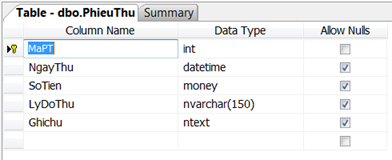
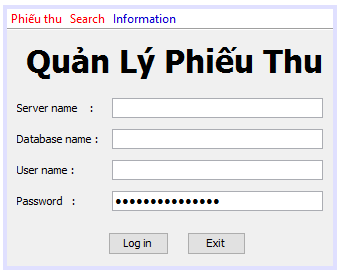
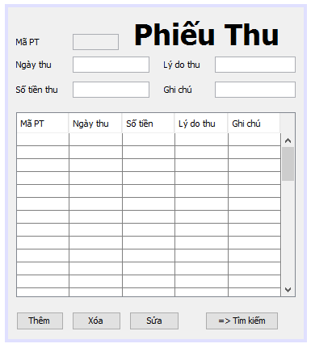
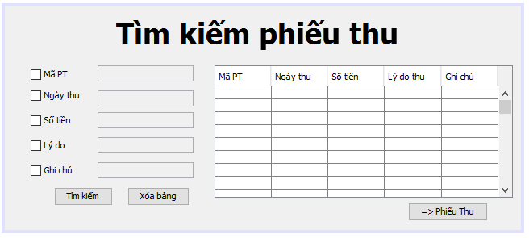

>This program shows how to connect to SQL Server 2005, and do some basic queries.

###Table of contents
* [Introduction](#introduction)
* [Requirements](#requirements)
* [Guide](#guide)
 * [Main interface](#main-interface)
 * [Bill interface](#bill-interface)
 * [Search interface](#search-interface)

#### Introduction
Given a Bill Database (SQL Server 2005) with `PhieuThu` table structure

MaPT is a primary key, and it's automatically increased (IDENTITY)

#### Requirements

Write a program which allows to do these tasks:

1. Search bills by using `MaPT` (Bill ID), `NgayThu` (Day of Bills), `SoTien` (Money), `LyDoThu` (Reason), `GhiChu` (Notice)
2. Can update/detele/update bills.
3. The program allows inputs as user information

#### Guide
##### Main interface
* The program will start with a login window. Fill correct information, and click `Log in` to connect to the `SQL Database` or `Exit` to quit the program.

   

* Abbreviations
  * `Phiếu thu` = `Bills` : Open Bills form
  * `Tìm kiếm` = `Search` : Open Search form
  * `Thông tin` = `Information` : Open Information form and show information about me.
  * `Quản Lý Phiếu Thu` = `Bill management system`

##### Bill interface
* All data in the DB will be shown. There are some features to `Add`, `Delete`, `Update` records.
  
  

* Abbreviations:
 * `Mã PT` = `Bill ID` : It will be automatically created.
 * `Ngày thu` = `Day` : Fill in for the add button.
 * `Lý do thu` = `Reason` : Reason for creating this bill.
 * `Số tiền thu` = `Amount of money`
 * `Ghi chu1` = `Note`
 * `Thêm` = `Add` button : Add new record to the DB and the grid, with information from `Bill ID`, `Day`, `Reason`, `Money`, and `Note`.
 * `Xoá` = `Delete` button : Delete a selected record from the grid.
 * `Sửa` = `Update` button : Update new information for selected record.
 * `Tìm kiếm` = `Search` button : Switch to `Search` form.

##### Search interface

* Search all information by using keywords from checkboxes. 
* Users can search by `Bill ID`, `Day`, `Amount of Money`, `Reason`, or `Note` by ticking the checkboxes, and fill in information
* Click `Tim kiem` = `Seach` to start searching. The result will be shown in the grid.
* `Xoá bảng` = `Empty Grid` button is used to clear the grid.
* `Phiếu Thu` = `Bill` button is used to switch to `Bill` form

   

