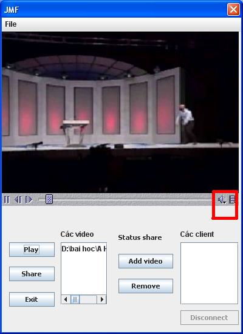

> This application based on client-server model, it is used to share stream videos to clients in a local network.

##Requirements
1. There is a computer as a server. It can share videos for other people at their clients. The server can play one or many videos to share for others. Controller of the server is able to choose which video will be played on the list (.avi file) and turn on the sharing feature. Clients connect to the server at different moments but they have to watch the same content from the video.
2. Clients can create nicknames theirselves. Successful connections allow clients to watch videos.
3. Clients can pause, or stop during streaming operation.
4. Server can observe how many clients are connecting, and has ability to disconnect clients at anytime.

##Content
* [Source code](Source%20code) of the project.
* [Executable jar files](File%20Jar%20Thuc%20Thi).
* [Built files](File%20Build).
* Report (How to participate, use the program).

##Features
* Perform all requirements.
* The program runs on all Windows platforms.
* Streaming with sound.

##Process
####Server
* Server uses JMF library to play videos with `.avi`, and other extensions such as `.mpg`. When users start the program, this will trigger `main Thread` running continuously to listen to connections from clients.
* If there is a request from a client, the server gives this client an ID to distinguish other clients. The server sends back to this client audio, and video ports that help the client to receive audio, and video from the server.
* After the connection, server also runs another `Thread` which is reponsible to listen the disconnection request from the clients.
* When the connections is set up. Server starts 2 threads. The first one will capture the screen 24f/s, and send continuously to the client while the second thread records the sound, and sends directly to the client.

####Client
* After filling all information to the form including Server IP, and its name (Clients are allows to name theirselves), clients send request to connect to server.
* After connections are granted. Clients start 2 threads. One is for receiving video, and another one is used for receiving audio that comes from the server.

##Guide
Video link for the demo `http://www.youtube.com/watch?v=Jo0SyWUYs9E&feature=player_embedded`

####Server

  

* **File** includes `Open` to open streamed videos, add into `Video List` to share to clients. `Exit` to quit the program.
* **Video List** is used to list all added videos for sharing.
* **Client List** is used to list all connected clients for sharing.
* Button **Play** is used to choose which video on `Video List` to share.
* Button **Share** is used to share a streaming video.
* Button **Exit** to quit the program.
* Button **Add video** to add videos from computer to `Video List`.
* Button **Remove** to delete selected video from `Video List`.
* Button **Disconnect** to stop sharing the selected video.

####Client

  

* `nickname`, `localhost` need to be filled up to connect to server.
* Button **Connect** is used to connect to the server, and watch a streaming video.
* Button **Disconnect** is used to stop the connection.
* Button **Exit** is used to quit the program.

####Usage

1. Open `server application`, add videos to the list.

    

2. Choose a video and click `Play`, the server plays this video.

    

3. Click `Share` to setup the connections for clients.

    

4. Open `Client application`, and fill information. Click `Connect` to watch the streaming video. Server will see which clients are connecting and watching.

    

5. It is possible to open many clients

    

6. Diconnect any client from the list by choosing `client name` and click `disconnect` from server side or client can disconnect itself.

    

    

7. Quit the program by click the button `Exit`

    

####Notice
* To `build` and `run` the program. Installation of JMF is a must.
* To have a sound of streaming videos. [This video](http://www.mediafire.com/?ybr1363de4sj9iw) is suitable, or use those video are available [here](../Demo).
* Pay attention to the `Sound` icon.

    

* Modify `Stereo Mix` 

    

    

