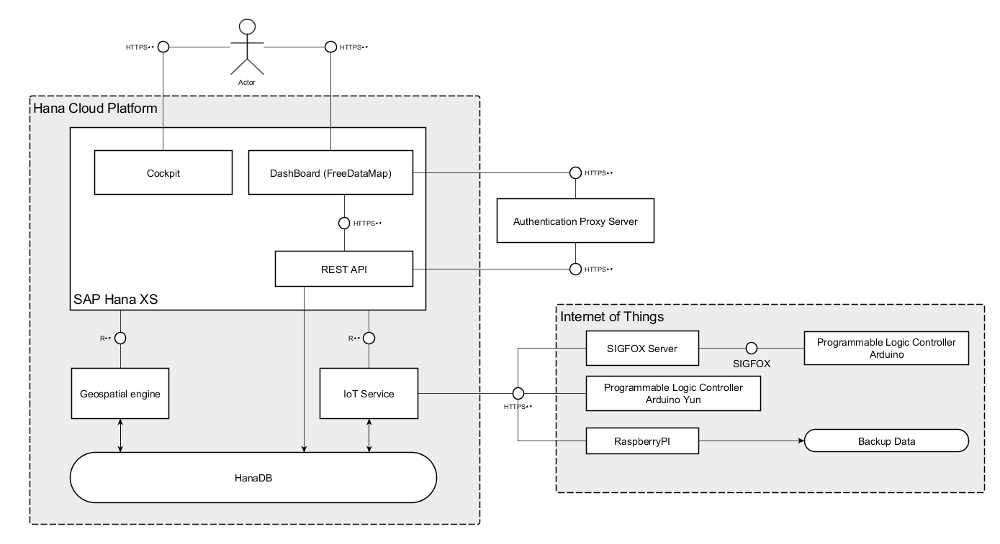
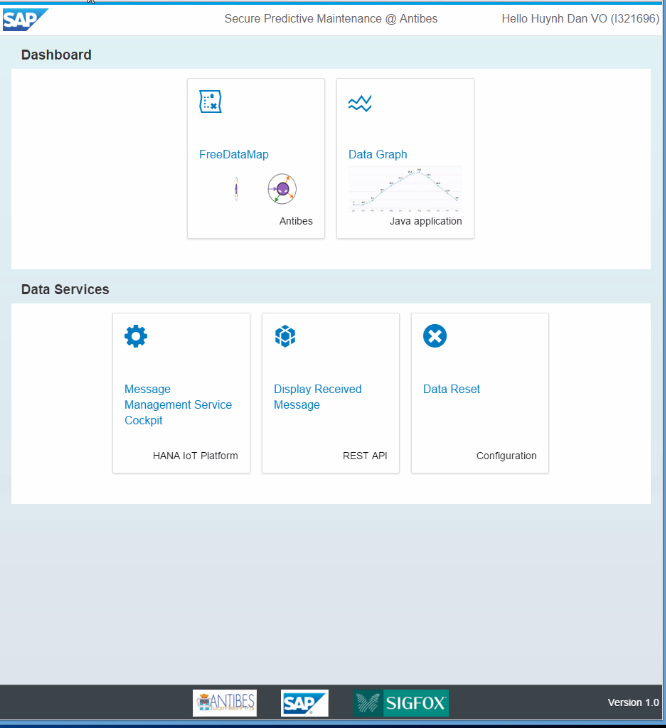
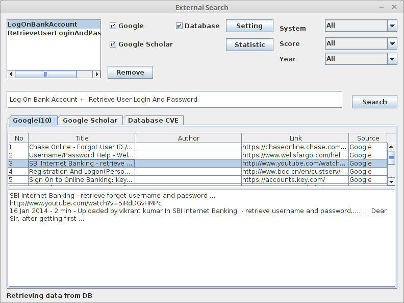
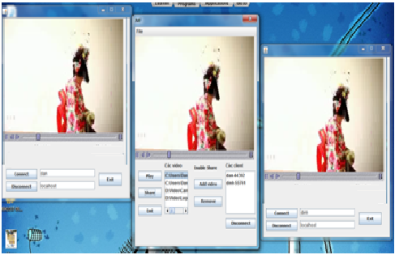
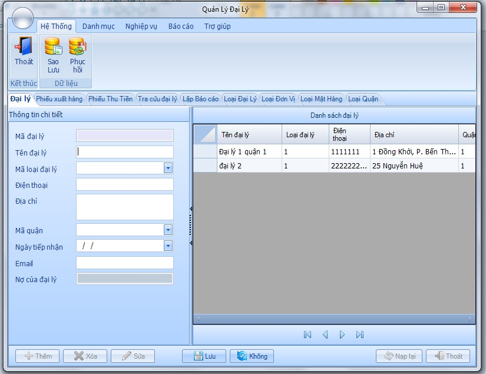

>This folder contains many different subfolders storing various projects that I have been working during my study. There are my 6-month internship at SAP Labs France, Eurecom semester project, exercises as well as projects relating to software development in different programming languages.

#Introduction
Most of the projects I mainly finished in `C/C++` or in `Java`. `Python` is a new language that I've had a chance to access recently since my Master's program at Eurecom under courses such as `System Security`, `SoftDev`, and `Forensics`. I'm really interested in this language, still studying it, and catching up. 

p/s Some projects you'll find strange because they're not in English. I am still working on them.

## Table of contents
* [Secure integration of Internet of Things](#secure-integration-of-internet-of-things)
* [Attack Crawler for Modern Networked Systems](#attack-crawler-for-modern-networked-systems)
* [Projects in C/C++](#projects-in-c-and-c-plus-plus)
* [Projects in Java](#projects-in-java)
* [Projects in Python](#projects-in-python)
* [Projects in CSharp](#projects-in-sharp)
* [Projects in Visual Basic](#projects-in-visual-basic)
* [Web projects](#web-projects)

## Secure integration of Internet of Things
I participated in a co-innovation project named [Secure Integration of Internet of Things](http://scn.sap.com/community/labs/blog/2015/06/25/co-innovation-project-on-predictive-analytics-for-pipeline-integrity). The requirements come from French Public Sector - City of Antibes. They'd like to have an end-to-end solution for data collected by more than 2000 sensors, and deployed for their water network. They use the data for `predictive maintenance` to predict the pipeline failures of the water network. In order to improve management, and financial optimization, they also would like to visualize their water network. The data will be encrypted at the beginning, and only decrypted at the end. In particular, I designed and implemented a sysmetrical cryptography to assure the confidentiality and integrity of the data accross many different platforms including `Arduino` (C/C++), `Raspberry Pi` and `Intel Edision` (Python), `DataGraph application` and `FreeDataMap` (Java, and Javascript). Setup a secure connection between `PLCs`, `SIGFOX`, and `HANA Cloud Platform`. The final step of this project is to evaluate the security perspective. I built an attack tree containing attack models, and considered all possible attacks that could happend to the system, and provided suggestions on how to defend, and mitigrate those risks.

I am so sorry to say that this project is confidential. Therefore, I cannot reveal the information. However, if you are interested in this project, I have a **presentation file** [here](https://github.com/dandavid3000/Documents/blob/master/SecureIoT/SAP_Defense.pptx), and **some demo videos** are available [here](https://www.youtube.com/playlist?list=PLdaye8eh9RXBh5d2a3kdM_no-PMQ2ORsD) which I used for my defense. I also completed an Enterprise Github about this work to help others can replicate my concept, as well as a detailed report with more than 150 pages.

At the end, the concept worked perfectly, it's considered to develop and deloy as a real bussiness.

I am really into this project because it brought me a lot of experiences. I could improve my programming skills, and learnt new languages, platforms. In addition, I had a chance to improve my communication skills by communicating directly to the stakeholders in a multicultural environment, and access new modern technologies.

## Attack Crawler for Modern Networked Systems
Because we have a large scale attacks on networked systems have been conducted in recent year. Unfortunately, to study and analyse those attacks is quite complex, and requires gathering information from very diverse sourses.
The objective of this project is to evaluate which relevant information can be exracted from the internet and provided to users.
In particular, we developed a security feature for [TTool](http://ttool.telecom-paristech.fr/) which is an open-source software, and it's developed by professor [Ludovic Apvrille](http://perso.telecom-paristech.fr/~apvrille/) at Telecom ParisTech.

The project was divided into two main parts. Web crawler, and The assistant; a friendly interface which allows users to retrieve relevant information from the Database (Web crawler).

Regarding to our work in this projects:
* Studied, analysed, and illustrated a well-known attack [Stuxnet](https://en.wikipedia.org/wiki/Stuxnet) as a SysML-Sec attack model.
* Implemented a friendly user interface for users to retrieve information, perform the search
* Designed, and implemented a secure protocol as a bridge to let TTool, and The Crawler interact together.

The **final report** for this work is available [here](Java/Eurecom/SemesterFinalResult/FullSubmitted_Source/SemesterProjectReport_VO.pdf) along with the [source code](Java/Eurecom/SemesterFinalResult/FullSubmitted_Source/TTool.zip). The protocol is developed step by step, and stored [here](Java/Eurecom/SmallClient_Server/) from the simple one from multithreaded to the version that uses SSL socket.

## Projects in C and C plus plus

1. [Embedded programming](C/EmbeddedProgramming/Exercises)
This folder contains exercises and final project for the course. The project is about playing around wid leds on a board.
2. [Exercises](C/Exercises)
This folder contains exercises about algorithms, and data structures.
3. [Projects](C/Projects)
This folder contains important projects such as [Finding paths Algs](C/Projects/Algorithms), [Hardware security key breakdown](C/Projects/HardwareSec), and [Singer management](C/Projects/SingerManagement) which is an example of OOP Programming in C/C++.

## Projects in Java
1. [Eurecom](Java/Eurecom) This folder contains my semester project at Eurecom.
2. [Java exercises](Java/Projects/Exercises) There are some exercises about *IO*, *jdbc*, and *multithread*.
3. [Java mail app](Java/Projects/Final/JavaMailApp/0941037) This is my mail application in java.
4. [Java video streaming app](Java/Projects/Final/StreamingApplication) This is one of the most interesting projects. The application contains a client-server model. When a server plays a video, clients can connect to the server and watch the stream video.

5. [Java Bill Management](Java/Projects/BillManagement/) The application shows some basic interactions with SQL Server.

## Projects in Python

* [Challenges](Python/Challenges) This folder contains challenges as follows: 
  - [forensics1](Python/Challenges/Forensics1.py) Write a simple python script that, by invoking tshark, prints the IPs that are likely natted using the TCP timestamp option. Requirements: 
    - self-contained python script that uses tshark for the packet analysis. 
    - The tool should receive a pcap file as parameter and print the IP addresses that are likely natted. 
  - [forensics2](Python/Challenges/Forensics2.py) Write a script that, using SleuthKit, checks all the sector slack at the end of each file in a ext3 partition and dumps the ones that contain data. Requirements:
    - self-contained python script that either use the SleuthKit bindingins or invoke it as a subprocess
    - the tool should check all file in a filesystem specified as parameter
    - shows a progress bar to tell the user the percentage of files analyzed so far
    - for each file that has data in the slack space, create a file in a subdirectory named with the inode number and containing the slack bytes
  -  [forensics3](Python/Challenges/Forensics3.py) Write a python script to detect camouflaged files. The script should use the python magic bindings compare the results with the mime types (extracted from `/etc/mime.types` by default or by a file specified as parameter)
    - The script should take as input a directory and recursively analyze its content.
    - Collect a memory snapshot of a linux machine. Install volatility 2.4 (use the official release, not the development version), build the profile for your linux dump, and test that it works by listing the processes in the memory image. Then, using volatily as a library (example), write a tool that accepts as parameters two snapshot taken from the same machine at different times (e.g., 15 minutes one after the other) and for each processes (uniquely identified by its PID), list the number of pages that are different between the two snapshots.

-

* [Network project](Python/Network1_Project) Building a client-server in Python with requirements below - Please check [this report](Python/Network1_Project/Report.pdf) for the work.
  - Implement a client capable of scraping data from a webpage and to store
these data into a small database
    - You will have to use sockets – no existing library will be allowed
    - The database must be implemented as a TCP server – you will have to define your own application protocol!
  - Use a library like dryscrape for scraping more complex webpages.
    - https://dryscrape.readthedocs.org/en/latest/
    - You should select two different sites
    - Run two instances of your scraping engine using threads, while scraping two different pages (e.g. scrape prices from merchant websites)
    - Store your results in a database now shared between threads (watch out for potential synchronization issues!)

## Projects in CSharp
>Most are B2B applications, and exercises

1. [Book management app](CSharp/BookManagement/06k3021) This app is used to manage a book system. There are some basic features such as adding, deleting, updating books. It's based on 3-layer model.
2. [Exercises](CSharp/Exercises) This folder contains applications about basic features in building an application using *SQL*, or *Access* databases.
3. [Sale management app](CSharp/SalesManagement/QLDaiLy) This is similar to `Book management app` with other system.
4. [Acency management app](CSharp/Final/SemesterProject/) This is the final project with set-up kits, report, and source code.

## Projects in Visual Basic
1. [School management app](VisualBasic/FinalProject/AppliedManagementApplication) An application to manage students, teachers with 3 layers written in VB.
2. [Exercises](VisualBasic/Exercises) This folder contains some basic programs such as *Hospital management*, *Scheduling*, *Student management*.

## Web projects
1. [E-commerce](Web/E_Commerce) a web system that connects many websites together to perform e-commerce. For example, a website can connect to a bank to do the payment, and supply APIs for other websites about it's products.
2. [The pictures](Web/ThePictures) A basic web project for building an entertaining website
3. [Web interaction](Web/WebInt) This folder contains assignments, project of the course that I studied about HTML5, CSS, and javascript.
