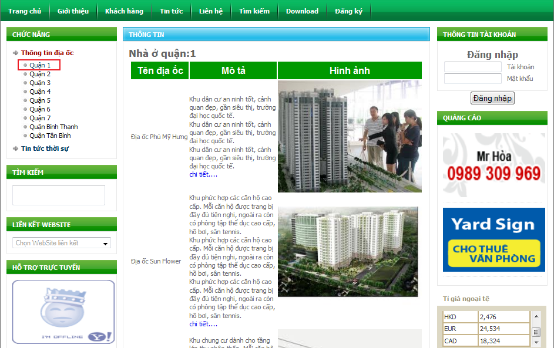
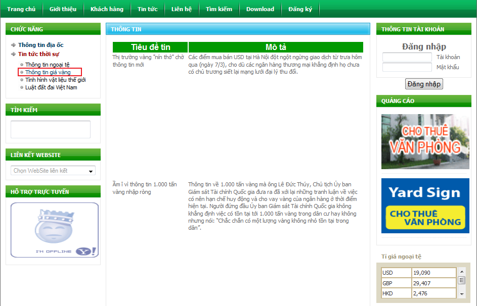
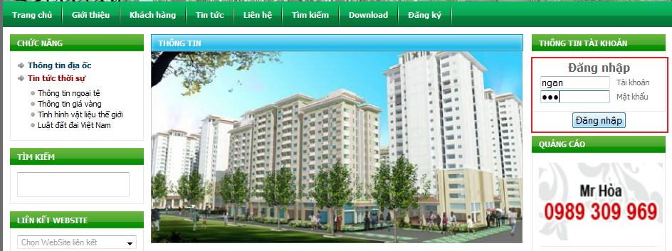
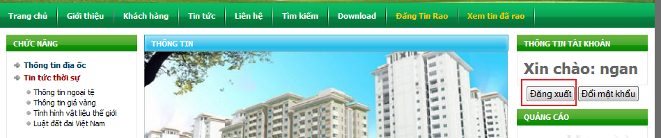
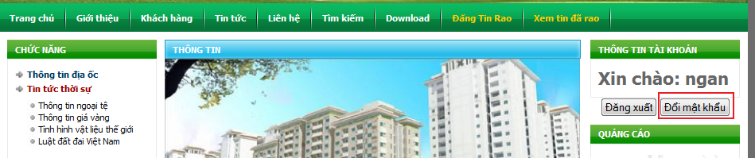
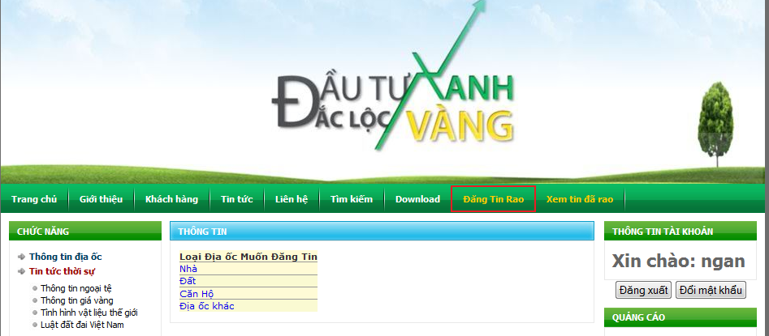
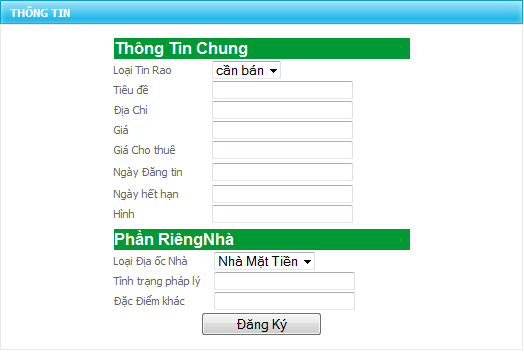
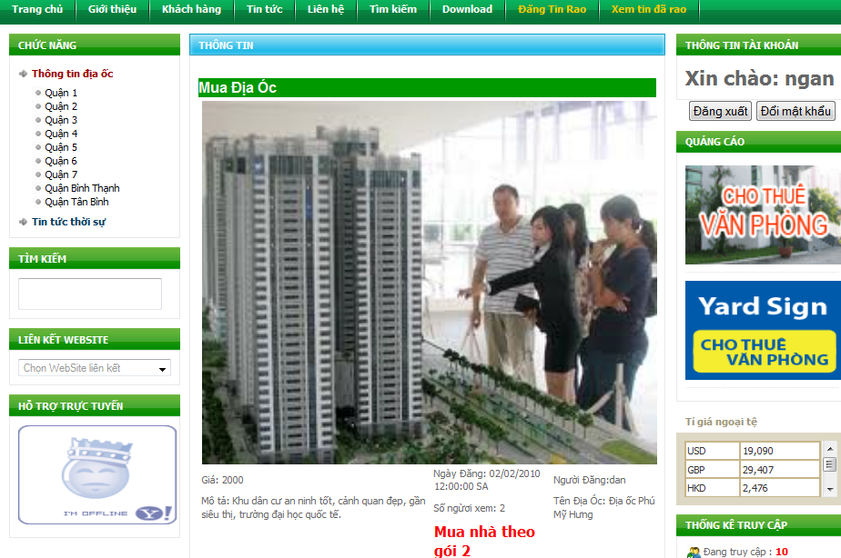
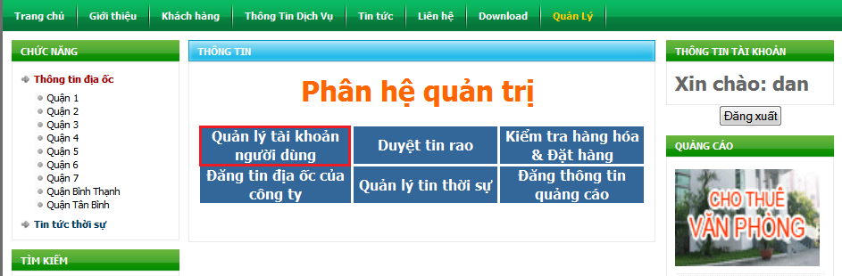
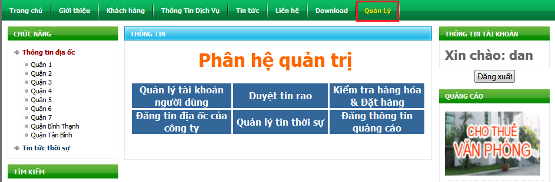

## Table of contents
* [Guide](#guide)

### Guide
There are 3 parts:
* Unregistered client features
* Registered client features
* Administration features
* Other features

#### Unregistered clients
* Web interface

  
  
* Clients can retrieve information of buildings by selecting `location`. After than the website will show detail.

  
  
* Clients can also read news

  
  
* Clients can do `Classified advertising` on the website
* Clients can register to become users of the website

 

#### Registered clients
* Includes unregistered client features
* Login and Logout
  * Fill correct information, and click `login` 
  
    

  * After loggin in, clients can log out.
  
     

  * Change their passwords, and update account information
    * Password change: Type new password, check, and update new password

        
        
        

  * Register `Classified advertising` by choosing the type of building, and fill in extra relevant information. Click `Dang Ky` = `Register` to finish.
  
        

        
        
  * Purchase buildings: Clients select desire buildings. The system will show packages of the buildings. Client can choose `Package purchase` to link to other services
 
    

#### Administration
* The unique page for administrators
  * Login to the system with administration permission. Choose `Quan Ly` tab to use those features
 
   

  * User management

   
